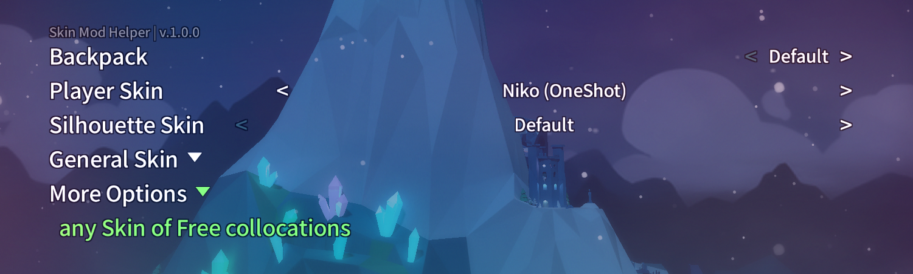

Celeste Skin Mod Helper
==========================
This is an [Everest](https://everestapi.github.io/) mod for [Celeste](http://www.celestegame.com/) 
that provides tools and support for skin modding.

Installation Guide
------------------
1. Install [Everest/Olympus](https://everestapi.github.io/) for [Celeste](http://www.celestegame.com/).
2. Install [Skin Mod Helper](https://gamebanana.com/mods/166543) from GameBanana.
3. Install any compatible skin mod from GameBanana.

Features
------------
**For Players**:

Swap between compatible skin mods on the fly using the mod options menu, no restart required! 
You can do this from the main menu or from in-game.

**For Mappers**:

Use the Skin Swap Trigger to change the player's skin to any loaded skin mod! Usable in Ahorn or Lönn.
 
 
**For Skin Modders**:

Currently reskinnable objects include:
1. Player, Other Self, and other sprites defined in Sprites.xml
2. Portraits
3. Textboxes
4. Particles (death, dream block, feather)
5. More by request!

Setting up your skin mod correctly requires some configuration. 
See the [guide](docs/guide/README.md) for more information.

Contact
-------
If you encounter any issues or have suggestions, on this forked, you can reach me on Discord (AAA1459#7937)

Credits
-------

**Creator**: Bigkahuna

**Code Contributors**:
* coloursofnoise
* max480
* Viv

**Special Thanks**:
* crowberry
* Nikko
* Zaro
